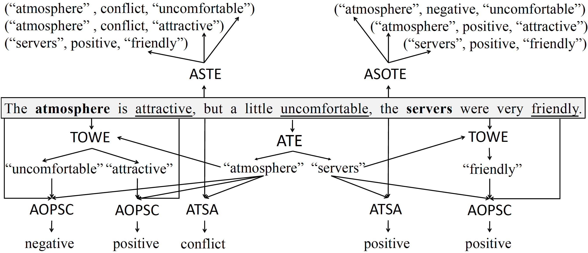

# Opinion-Triplet-Extraction-Papers
This repository includes papers about the opinion triplet extraction task, which aims to extract (aspect term, sentiment, opinion term) triplets from sentences.  The opinion triplet extraction task includes two subtasks: Aspect Sentiment Triplet Extraction (ASTE) and Aspect Sentiment Opinion Triplet Extraction (ASOTE).
- ASTE extracts triplets where the sentiment is the sentiment that the sentence expresses toward the aspect term.
- ASOTE extracts triplets where the sentiment is the sentiment of the (aspect term, opinion term) pair.

There are some relevant tasks:
- ATE (Aspect Term Extraction) extracts aspects from sentences.
- TOWE (Target-oriented Opinion Words Extraction) extracts opinions associated with a given aspect in a sentence. 
- ATSA (Aspect Term Sentiment Analysis) predicts the sentiment that a sentence expresses toward a given aspect.
- Aspect-Opinion Pair Sentiment Classification (AOPSC) predicts the sentiment of a (aspect term, opinion term) in a sentence.

An example showing the inputs and outputs of the tasks mentioned above. For each arrow, when the head is a task name, the tail is an input of the task; when the tail is a task name, the head is an output of the task. The bold words are aspects. The underlined words are opinions.

# ASTE
- 2020-aaai-Knowing What, How and Why A Near Complete Solution for Aspect-based Sentiment Analysis [paper](https://ojs.aaai.org/index.php/AAAI/article/view/6383)
- 2020-emnlp-findings-A Multi-task Learning Framework for Opinion Triplet Extraction [paper](https://aclanthology.org/2020.findings-emnlp.72/) [code](https://github.com/GeneZC/OTE-MTL) [code-for-ASOTE](https://github.com/l294265421/OTE-MTL-ASOTE)
- 2020-emnlp-findings-Grid Tagging Scheme for Aspect-oriented Fine-grained Opinion Extraction [paper](https://aclanthology.org/2020.findings-emnlp.234.pdf) [code](https://github.com/NJUNLP/GTS) [code-for-ASOTE](https://github.com/l294265421/GTS-ASOTE)
- 2020-emnlp-Position-Aware Tagging for Aspect Sentiment Triplet Extraction [paper](https://aclanthology.org/2020.emnlp-main.183.pdf) [code](https://github.com/xuuuluuu/Position-Aware-Tagging-for-ASTE) [code-for-ASOTE](https://github.com/l294265421/Position-Aware-Tagging-for-ASOTE)
- 2020-nlpcc-Hierarchical Sequence Labeling Model for Aspect Sentiment Triplet Extraction [paper](https://link.springer.com/chapter/10.1007/978-3-030-60450-9_52)
- 2021-aaai-A Joint Training Dual-MRC Framework for Aspect Based Sentiment Analysis [paper](https://www.aaai.org/AAAI21Papers/AAAI-5353.MaoY.pdf)
- 2021-aaai-Bidirectional Machine Reading Comprehension for Aspect Sentiment Triplet Extraction [paper](https://arxiv.org/pdf/2103.07665.pdf) [code](https://github.com/NKU-IIPLab/BMRC)
- 2021-First Target and Opinion then Polarity- Enhancing Target-opinion Correlation for Aspect Sentiment Triplet Extraction [paper](https://arxiv.org/abs/2102.08549)
- 2021-Explicit Interaction Network for Aspect Sentiment Triplet Extraction [paper](https://arxiv.org/pdf/2106.11148.pdf)
- 2021-acl-findings-Semantic and Syntactic Enhanced Aspect Sentiment Triplet Extraction [paper](https://aclanthology.org/2021.findings-acl.128.pdf)
- 2021-acl-Learning Span-Level Interactions for Aspect Sentiment Triplet Extraction [paper](https://aclanthology.org/2021.acl-long.367.pdf) [code](https://github.com/chiayewken/Span-ASTE) [code-for-ASOTE](https://github.com/l294265421/Span-ASOTE)
- 2021-cikm-Aspect Sentiment Triplet Extraction Using
Reinforcement Learning [paper](https://arxiv.org/pdf/2108.06107.pdf) [code](https://github.com/declare-lab/ASTE-RL)

# ASOTE
- 2021-A More Fine-Grained Aspect-Sentiment-Opinion Triplet Extraction Task [paper](https://arxiv.org/abs/2103.15255) [code](https://github.com/l294265421/ASOTE)
